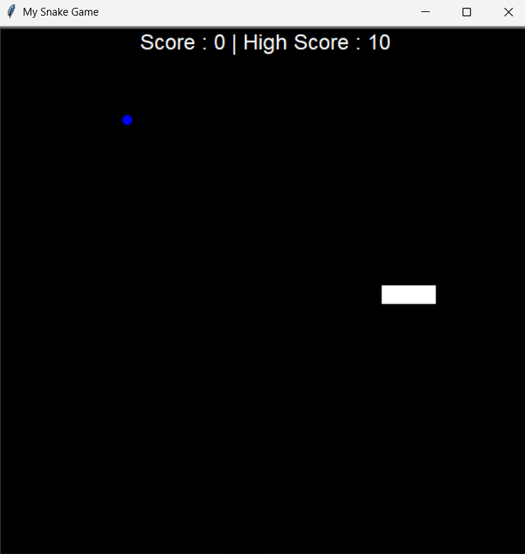

🐍 Snake Game in Python

A classic Snake Game built using Python and the Turtle graphics library.
Control the snake, eat the food, and grow longer — but avoid hitting the walls or yourself!

🎮 Features

Smooth snake movement

  Food generation at random locations

Score tracking system

Game-over detection and restart option

Simple yet addictive gameplay

🧠 Tech Stack

Language: Python

Library: Turtle (for graphics and controls)

⚙️ How to Run

Clone the repository

git clone https://github.com/<your-username>/<repo-name>.git

Navigate to the project directory

cd <repo-name>

Run the game

python main.py

🎯 Controls
Key	Action
⬆️	Move Up
⬇️	Move Down
⬅️	Move Left
➡️	Move Right
🏆 Objective

Eat as much food as possible to increase your score.

Don’t crash into the walls or yourself!

📸 Screenshot

(Add your game screenshot here if you have one — )

💡 Future Enhancements

Add levels or speed increase

Include background music and sound effects

Create a leaderboard system

Add a pause/resume feature

🧑‍💻 Author

Karthikeyan K
Passionate Python developer exploring fun projects like games and automation.
